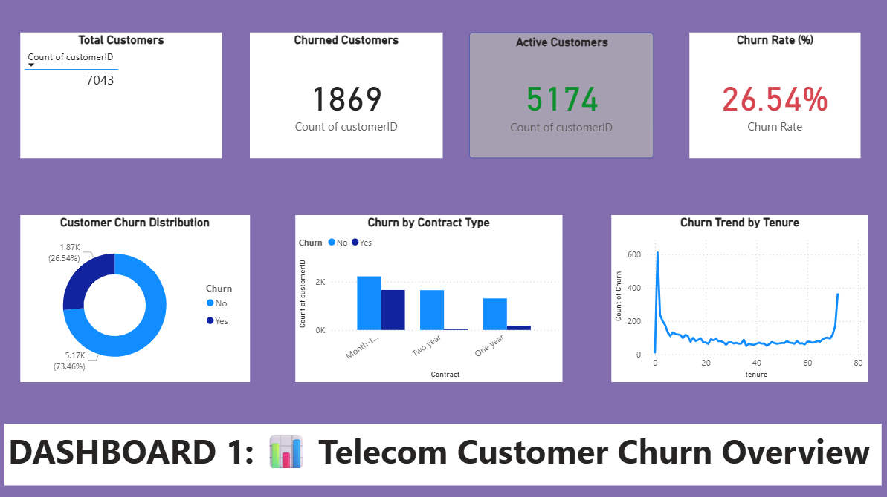
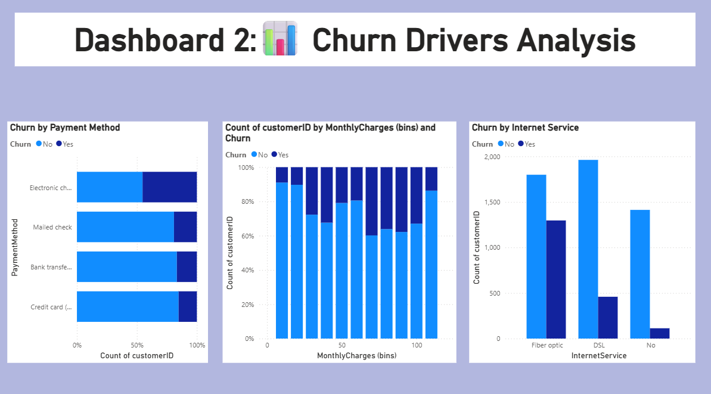
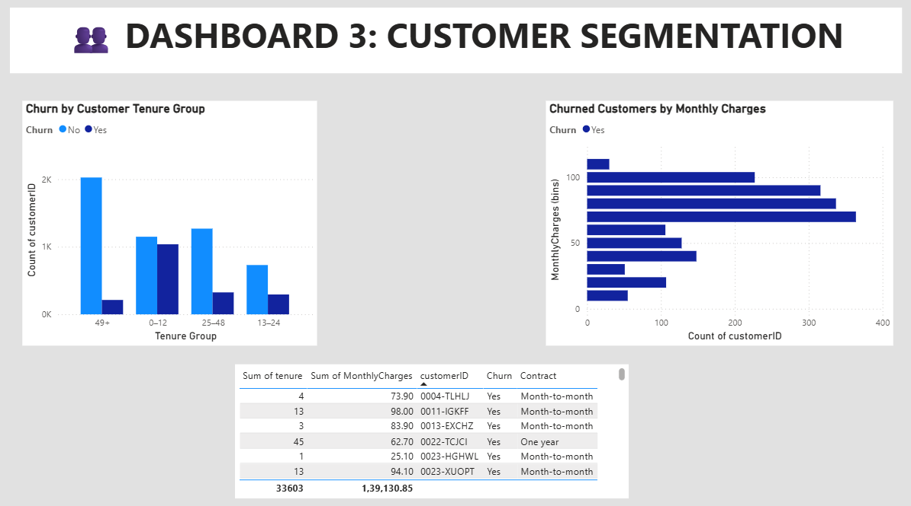

# Customer Churn Analysis & Retention Strategy

## 📌 About the Project

Customer churn means customers leaving a company's service. For telecom companies, understanding why customers leave is important because losing customers can affect revenue and increase the effort required to acquire new customers.

In this project, I worked on customer churn data to understand customer behavior and find patterns related to churn.

I used **Python** for data cleaning and analysis and **Power BI** to create interactive dashboards. Based on the analysis, I also suggested some customer retention strategies.

This project was completed as part of my **Data Analytics Internship / Training**.

---

## 🎯 Project Objectives

The main things I wanted to achieve through this project were:

- Understand customer churn data.
- Find the overall churn rate.
- Analyze which customer groups have higher churn.
- Study churn based on contract type, tenure, payment method and internet service.
- Analyze the relationship between monthly charges and churn.
- Create customer segments for better analysis.
- Build interactive Power BI dashboards.
- Suggest possible strategies to improve customer retention.

---

## 💼 Business Problem

The main business questions I tried to answer were:

- How many customers have churned?
- Which contract types have more churn?
- Do new customers show different churn patterns?
- Does monthly charge have any relationship with churn?
- How does churn vary by payment method?
- How does churn vary by internet service?
- Which customer groups may need more attention?
- What actions could a company consider to improve retention?

The aim was to use customer data to answer these questions and find useful business insights.

---

# 📂 Dataset

## Dataset Used

**IBM Telco Customer Churn Dataset**

## Dataset Source

I used the publicly available dataset from Kaggle:

https://www.kaggle.com/datasets/blastchar/telco-customer-churn

The dataset contains information about telecom customers, their services, contracts, payments, charges and churn status.

### Dataset Details

- **Number of customers:** 7,043
- **Number of columns:** 21
- **Target column:** `Churn`

### Important Columns

| Column | Description |
|---|---|
| customerID | Unique ID of the customer |
| gender | Customer gender |
| SeniorCitizen | Shows whether the customer is a senior citizen |
| Partner | Whether the customer has a partner |
| Dependents | Whether the customer has dependents |
| tenure | Number of months the customer has stayed |
| PhoneService | Phone service information |
| InternetService | Type of internet service |
| Contract | Type of customer contract |
| PaymentMethod | Customer payment method |
| MonthlyCharges | Monthly amount charged |
| TotalCharges | Total amount charged |
| Churn | Whether the customer left the service |

### Churn Column

- **Yes** → Customer churned
- **No** → Customer did not churn in the available dataset

**Dataset Note:** I used a publicly available IBM Telco Customer Churn dataset from Kaggle for this project.

---

# 🛠️ Tools I Used

### Python
- Pandas
- NumPy
- Matplotlib
- Seaborn

### Dashboard
- Microsoft Power BI
- DAX

### Development
- Jupyter Notebook

### Project Sharing
- GitHub

---

# 🔄 Project Process

I followed these steps while working on the project:

```text
Dataset Collection
       ↓
Data Understanding
       ↓
Data Cleaning
       ↓
Data Preprocessing
       ↓
Exploratory Data Analysis
       ↓
Churn Analysis
       ↓
Customer Segmentation
       ↓
Power BI Dashboard
       ↓
Insights
       ↓
Retention Strategies
```

---

# 🧹 Data Cleaning

Before starting the analysis, I prepared the dataset for further analysis.

The main steps were:

- Checked the number of rows and columns.
- Checked column names and data types.
- Checked missing values.
- Checked duplicate records.
- Converted `TotalCharges` into numeric format.
- Handled missing values.
- Prepared the `Churn` column for analysis.
- Created customer tenure groups.

The cleaned data was then used for analysis and Power BI.

---

# 📈 Data Analysis

I used Python to explore the customer data and understand churn patterns.

The analysis included:

- Overall customer churn distribution
- Churn by contract type
- Churn by customer tenure
- Churn by payment method
- Churn by internet service
- Monthly charges and churn
- Customer segmentation

I used **Pandas** for data analysis and **Matplotlib** and **Seaborn** for visualizations.

---

# 📊 Power BI Dashboard

I created three Power BI dashboard pages to present the analysis.

## 1. Customer Churn Overview

The first dashboard gives an overall view of the customer churn situation.

### KPIs

- Total Customers
- Churned Customers
- Retained Customers
- Churn Rate

### Visuals

- Customer Churn Distribution
- Churn by Contract Type
- Churn by Tenure



---

## 2. Churn Drivers Analysis

The second dashboard focuses on factors related to customer churn.

### Visuals

- Churn by Payment Method
- Monthly Charges vs Churn
- Churn by Internet Service

This page helped me compare churn patterns across different customer and service categories.



---

## 3. Customer Segmentation

The third dashboard focuses on different customer groups.

### Analysis

- Churn by Customer Tenure Group
- Churned Customers by Monthly Charges
- Customer-level analysis

This page helped me understand how churn differs between different customer groups.



---

# 🔍 Key Findings

Some important patterns I observed during the analysis were:

- Month-to-month customers showed higher churn compared with customers on longer-term contracts.
- Customers with shorter tenure showed noticeable churn patterns.
- Churn levels varied across different payment methods.
- Churn also varied across internet service categories.
- Monthly charges helped identify different customer groups.

These findings helped me understand which customer groups may need more attention.

---

# 💡 Retention Strategies

Based on the analysis, I suggested the following possible strategies:

### 1. Better Support for New Customers

Provide better onboarding and support during the initial months.

### 2. Encourage Long-Term Contracts

Provide suitable offers to month-to-month customers to encourage longer-term plans.

### 3. Personalized Offers

Use customer information, tenure and billing patterns to provide relevant offers.

### 4. Loyalty Benefits

Provide suitable benefits to long-term customers.

### 5. Monitor High-Churn Groups

Regularly monitor customer groups with higher churn and plan targeted retention activities.

> These are suggested strategies based on the analysis. They would need to be tested with actual customer and campaign data before measuring their business impact.

---

# 📚 What I Learned

Through this project, I learned how to:

- Clean and prepare customer data.
- Use Pandas and NumPy for data analysis.
- Perform Exploratory Data Analysis.
- Create charts using Matplotlib and Seaborn.
- Analyze customer churn.
- Create customer segments.
- Build Power BI dashboards.
- Create DAX measures.
- Present data in a simple way.
- Connect data analysis with a business problem.

---

# ⚠️ Limitations

This project uses a publicly available historical dataset, so some information that may be available in a real company environment is not included.

For example:

- Customer feedback
- Customer complaints
- Call center interactions
- Competitor information
- Real-time customer activity
- Results of actual retention campaigns

Adding these types of information could make the analysis more detailed.

---

# 🚀 Future Scope

In the future, this project can be extended by:

- Building a machine learning model to predict churn.
- Adding customer feedback and sentiment analysis.
- Creating a churn-risk score.
- Adding regularly updated customer data.
- Creating automated alerts for high-risk customers.
- Measuring the results of retention campaigns.

---

# 📁 Project Structure

```text
Customer-Churn-Analysis-Retention-Strategy/
│
├── README.md
├── Telecom_Customer_Churn.pbit
├── pythonlibraries.ipynb
├── dashboard_1_overview.png
├── dashboard_2_churn_drivers.png
├── dashboard_3_customer_segmentation.png

```

---

# 📓 Python Notebook

The Jupyter Notebook contains the main analysis steps:

1. Importing libraries
2. Loading the dataset
3. Understanding the data
4. Checking missing values
5. Cleaning the data
6. Data preprocessing
7. Exploratory Data Analysis
8. Churn analysis
9. Customer segmentation
10. Churn driver analysis
11. Finding insights
12. Suggesting retention strategies

---

# 📊 Power BI File

The Power BI file contains three dashboard pages:

- Customer Churn Overview
- Churn Drivers Analysis
- Customer Segmentation

The dashboard includes KPI cards, charts and customer analysis visuals.

---

# 🏁 Conclusion

This project gave me practical experience in using data analytics to study a customer churn problem.

I started with customer data, cleaned and analyzed it using Python, and then created Power BI dashboards to present the findings.

The project helped me improve my skills in **Python, data analysis, visualization, Power BI, DAX and business-oriented problem solving**.

It also helped me understand how analytical findings can be connected to possible business actions such as customer retention.

---

# 👩‍💻 Project Information

**Project Name:** Customer Churn Analysis & Retention Strategy

**Domain:** Data Analytics

**Project Type:** Data Analytics Internship / Training Project

**Course:** B.E. Computer Engineering

**Tools:** Python, Pandas, NumPy, Matplotlib, Seaborn, Power BI, DAX

**Dataset:** IBM Telco Customer Churn Dataset

**Dataset Source:** Kaggle
